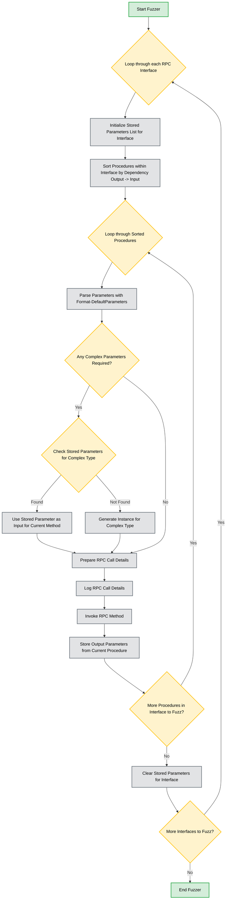

# Design for a solution to procedure dependency

Currently, the fuzzer directly formats all parameters for a procedure using the `Format-DefaultParameters` function.
If the parameter is "complex", for example a contex handle, the RPC call will most likely result in a `Parameter Invalid` error message.
This is because by default we create an instance for these parameters: `return [System.Activator]::CreateInstance($Type)`

To improve this and actually make a proper call, we should get a valid parameter value for the complex type.
The chosen approach is to first sort all the procedures within the interface, depending on what their input parameters are.
For example, if procedure A outputs a parameter that procedure B needs, it will first call procedure A and store it's output parameter in a list.

This fuzzing method/algorithm can be used instead of the default one by setting the parameter:
```powershell
'.\rpcServerData.json' | Invoke-RpcFuzzer --OutPath .\output\ -FuzzerType sorted
[+] dbghelp.dll successfully initialized
[+] Starting fuzzer...
[+] Completed fuzzing
[+] To load data into Neo4j use: '.\output\Allowed.json' | Import-DatatoNeo4j -Neo4jHost '127.0.0.1:7474' -Neo4jUsername 'neo4j'
```

