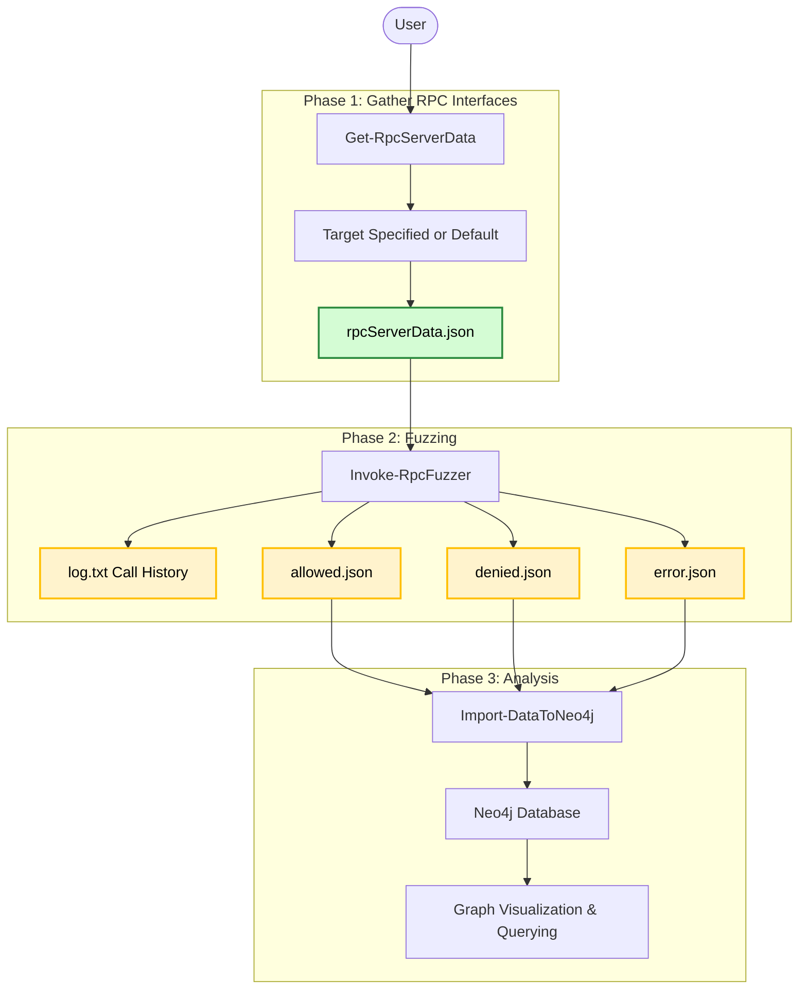

# MS-RPC Fuzzer - documentation

## Naming convention
You will see some terms in this code and readme that can get a bit confusing, so read this table to understand what it means.
| Term           | Explanation                                                                            |
|----------------|----------------------------------------------------------------------------------------|
| RPC Server     | Is the actual implementation that exposes functions that can be called using MSRPC.                      |
| RPC Client     | The client that connects to the RPC server and calls functions/procedures     |
| RPC Interface  | Defines the set of procedures that can be called remotely.                   |
| RPC Procedure  | A RPC interface includes procedures (functions) that can be invokes by a client       |
| RPC Endpoint   | A RPC interface has atleast one endpoint where a client can connect over  |
| RPC Method     | Used in PowerShell as object to describe a RPC procedure                                               |
| Procedure Definition | How the procedure is defined, what parameters it takes, which are input, which are output |
| RPC Function   | Same as procedure                                                                         |

## Phases
First you should meet the [Requirements](../readme.MD#requirements). Next, I highly suggest you fuzz in a isolated environment. Do not fuzz on your own host since RPC calls can break stuff (even from a low privileged user).

### Import Module
First, import the MS-RPC-Fuzzer module:
```powershell
Import-Module .\MS-RPC-Fuzzer.psm1
```
This loads all cmdlets for both this fuzzer and NtObjectManager.



### Phase 1: Gather RPC interfaces and Endpoints
First, specify target and get RPC interfaces and RPC endpoints for the target. You can specify a filepath or a `NtCoreLib.Win32.Rpc.Server.RpcServer` object (which NtObjectManager gives you with `Get-RpcServer`). This will output a .json file "rpcServerData.json", which you can parse to the fuzzer. If there is not target specified, it will default to all .exe and .dll in `%systemdrive%\Windows\System32\`.

For more information on this phase, check [Get-RpcServerData](/docs/1%20Inventarize%20-%20Get-RpcServerData.md)

### Phase 2: Fuzzing

The fuzzer takes the exported JSON file by [Get-RpcServerData](/docs/1%20Inventarize%20-%20Get-RpcServerData.md) as required input. There are currently two types of fuzzers.

* Default fuzzer: Will statically create parameter values and create a default instance for complex parameter types.
* Sorted fuzzer: Dynamically sort procedures for the interface based on input and output parameters. For information see [the design](./Procedure%20dependency%20design.md).

Both fuzzer types can result in different results. If the `-FuzzerType` parameter is not specified, the fuzzer will choose the Default fuzzer.

The fuzzer will output maximal 3 json files and one logfile. It will write the RPC calls before invoking them to log.txt, this way if there is a crash (BSOD), you will know which call was responsible (last line)

It will separate the fuzz results into 3 json files:
- Allowed fuzzed inputs
- Fuzzed inputs that lead to a Access Denied
- Fuzzed inputs that lead to a Error

For more information on this phase, check [Invoke-RpcFuzzer](/docs/2%20Fuzzing%20-%20Invoke-RpcFuzzer.md)

### Phase 3: Analysis
You can use these JSON files for analysis as you like. However, the fuzzer has a option to import them into your Neo4j instance. The fuzzer has a data mapper that makes relations for the data.

For more information on this phase, check [Import-DataToNeo4j](/docs/3%20Analysis%20-%20Import-DataToNeo4j.md), [Neo4j](/docs/3.1%20Analysis%20-%20Neo4j.md) and [Process Monitor](/docs/3.2%20Analysis%20-%20Process%20Monitor.md)

## Known problemetic procedures
Some Windows built-in procedures cause the fuzzer to hang for a long time or never complete or crash the terminal. These are listed here and are recommended to exclude from your fuzzing process.

> [!NOTE]
> Some known procedures cause the system to crash or corrupt the user profile, for obvious reasons these are not obtained here, but have been reported to Microsoft.
```
s_VerifyWithSymmetricPopKey
s_EncryptWithSymmetricGcmPopKey
s_EncryptWithSymmetricPopKey
s_ImportSymmetricPopKey
svcQueryUserContextFromSid
svcQuerySessionVirtualAccountToken
FmMuxSrvShutdown
svcIsCandidateUser
svcRefreshCandidateUser
svcLaunchShell
NetrQueryServiceAccount
NetrEnumerateTrustedDomainsEx
NetrQuerySecureChannelDCInfo
```
Exclude with:
```powershell
".\output\rpcServerData.json" | Invoke-RpcFuzzer -OutPath .\output\ -Blacklist .\blacklist.txt
```