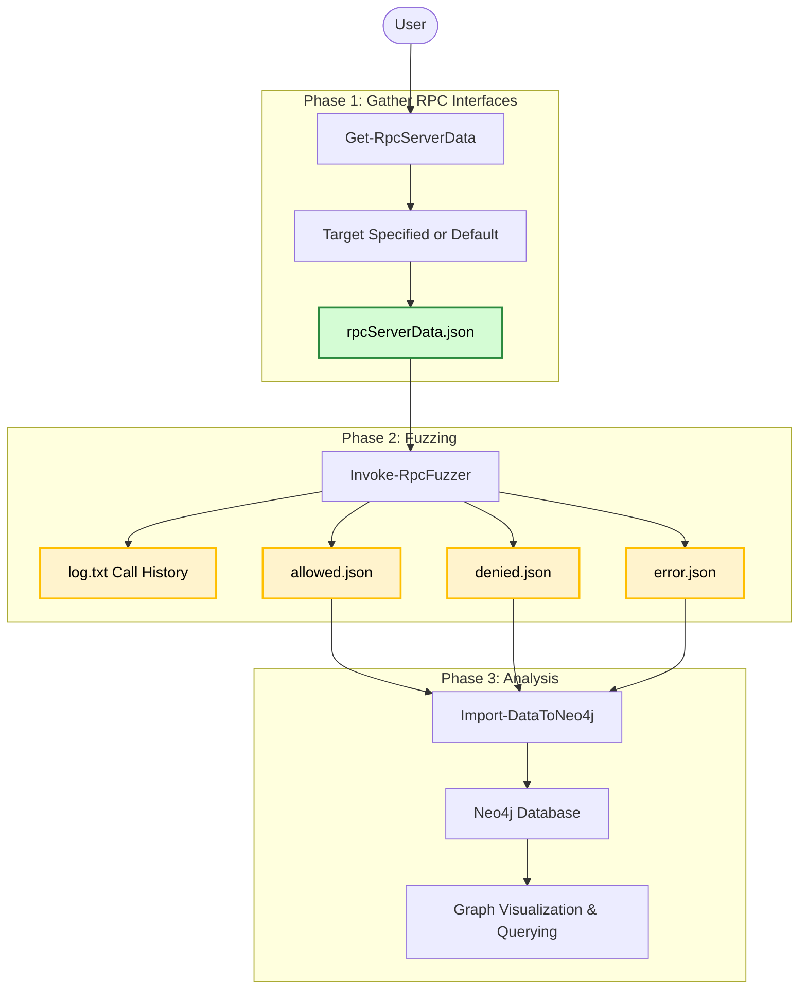

# MS-RPC Fuzzer

In the past few years, several high and critical severity vulnerabilities have been discovered in MS-RPC (Microsoft Remote Procedure Call). One functionality is that RPC allows clients to call functions on remote hosts. This opens the doors to potential vulnerabilities that could be exploited remotely. For these reasons, RPC is an interesting area of research.

It can be very time-consuming to manually research a specific RPC interface, let alone hundreds. Other than that, it was found that visualization for researching MS-RPC can get messy, which may result in missing potential security issues.

There are already some great tools out there that focus on MS-RPC vulnerability research. Some examples are [RpcView](https://github.com/silverf0x/RpcView), [RpcMon](https://github.com/cyberark/RPCMon) and [Rpcinvestigator](https://github.com/trailofbits/RpcInvestigator). These tools provide some insights into running RPC services in real-time. However, none of these tools allow further research to for example, connect to an endpoint and invoke RPC calls. This is where the PowerShell module [NtObjectManager](https://www.powershellgallery.com/packages/NtObjectManager) out stands. NtObjectManager allows dynamically building an RPC client from the parsed `NtApiDotNet.Win32.RpcServer`. This led to the idea of creating a fuzzer that can use these clients to fuzz the RPC-procedures their method's using random inputs. This fuzzer is heavily based on the NtObjectManager module.

The whole idea is to gain insights into MS-RPC implementations *that may be vulnerable* using an automated approach and make it easy to visualize the data. By following this approach, a security researcher will hopefully identify interesting RPC services in such a time that would take a manual approach significantly more.

> [!CAUTION]  
> This fuzzer almost certainly will break stuff in your OS (even from a low user), so please run it in a isolated and controlled environment and with permission!

> [!NOTE]
> The owner of this repository is not responsible for any damage of the usage made using these tools. These are for legal purposes only. Use at your own risks.

## Table of Contents
- [Requirements](#requirements)
- [Usage](#usage)
- [Results](#results-so-far)
- [Roadmap](#to-do-roadmap)
- [Known bugs](#known-bugs)

## Requirements
- [PowerShell 7](https://learn.microsoft.com/en-us/powershell/scripting/install/installing-powershell-on-windows)

## Usage
First, import the MS-RPC-Fuzzer module. This loads all cmdlets for both this fuzzer and NtObjectManager. 
```powershell
Import-Module .\MS-RPC-Fuzzer.psm1
```

The tool consists of three main phases. The first phase is where the RPC interfaces, endpoints and procedures are inventarized for the specified target and exported to a JSON file. The second phase is where the exported JSON file from the previous phase can be used to fuzz. The third and last phase is analysis. Phase two, fuzzing, exports json files containing the fuzzing results. A user can use these json files as they like. However, a custom wrapper can be used to import the json files into a Neo4j database.



### Phase 1: Gather RPC interfaces and Endpoints
First, specify target and get RPC interfaces and RPC endpoints for the target. You can specify a filepath or a `NtCoreLib.Win32.Rpc.Server.RpcServer` object (which NtObjectManager gives you with `Get-RpcServer`). This will output a .json file "rpcServerData.json", which you can parse to the fuzzer. If there is not target specified, it will default to all .exe and .dll in `%systemdrive%\Windows\System32\`.

```powershell
# Example
Get-RpcServerData -target "C:\Windows\System32\efssvc.dll" -OutPath .\output
```

For more information on this phase, check [Get-RpcServerData](/docs/1%20Inventarize%20-%20Get-RpcServerData.md)

### Phase 2: Fuzzing

The fuzzer takes the exported JSON file by [Get-RpcServerData](/docs/1%20Inventarize%20-%20Get-RpcServerData.md) as required input. 

There are currently two types of fuzzers.

* **Default fuzzer**: Will statically create parameter values and create a default instance for complex parameter types.
* **Sorted fuzzer**: Dynamically sort procedures for the interface based on input and output parameters. For information see [the design](./docs/Procedure%20dependency%20design.md).

The fuzzer will output maximal 3 json files and one logfile. It will write the RPC calls before invoking them to log.txt, this way if there is a crash (BSOD), you will know which call was responsible (last line)

It will separate the fuzz results into 3 json files:
- Allowed fuzzed inputs
- Fuzzed inputs that lead to a Access Denied
- Fuzzed inputs that lead to a Error

```powershell
# Example (all procedures)
'.\output\rpcServerData.json' | Invoke-RpcFuzzer -outpath .\output\ -minStrLen 100 -maxStrLen 1000 -minIntSize 9999 -maxIntSize 99999
```

For more information on this phase, check [Invoke-RpcFuzzer](/docs/2%20Fuzzing%20-%20Invoke-RpcFuzzer.md)

### Phase 3: Analysis
You can use these JSON files for analysis as you like. However, the fuzzer has a option to import them into your Neo4j instance. The fuzzer has a data mapper that makes relations for the data.

```powershell
# Example (Import data)
'.\output\Allowed.json' | Import-DatatoNeo4j -Neo4jHost 192.168.178.89:7474 -Neo4jUsername neo4j
```

For more information on this phase, check [Import-DataToNeo4j](/docs/3%20Analysis%20-%20Import-DataToNeo4j.md), [Neo4j](/docs/3.1%20Analysis%20-%20Neo4j.md) and [Process Monitor](/docs/3.2%20Analysis%20-%20Process%20Monitor.md)

## Results (so far)
> [!NOTE]
> Not all vulnerabilities were publicly disclosed, so some lack details.

| Number | Vulnerability type | Severity (by Microsoft) |                                                                Reference (if disclosed) |
| :----- | :----------------- | ----------------------: | --------------------------------------------------------------------------------------: |
| 1      | Coerce             |                Moderate |                                                          BSides Groningen, May 2nd 2025 |
| 2      | Coerce             |                Moderate |                                                                                    N.A. |
| 3      | Coerce             |                Moderate |                                                                                    N.A. |
| 4      | Coerce             |                Moderate |                                                                                    N.A. |
| 5      | Service crash      |               Important | [CVE-2025-26651](https://msrc.microsoft.com/update-guide/en-US/advisory/CVE-2025-26651) |
| 6      | System crash       |                Moderate |                     [Blog](https://www.incendium.rocks/posts/Unplugging-Power-Service/) |
| 7      | System crash       |                Moderate |                     [Blog](https://www.incendium.rocks/posts/Unplugging-Power-Service/) |
| 8      | System crash       |                Moderate |                                                                                    N.A. |
| 9      | Other DoS          |                Moderate |                                                                                    N.A. |
| 10     | Other DoS          |                Moderate |                                                                                    N.A. |

> [!TIP]
> Found a possible new vulnerability? Congrats! Report it to Microsoft (MSRC): https://msrc.microsoft.com/report/vulnerability

## To do (roadmap)
- For each endpoint map the ACL
- Sometimes, a RPC call takes very long/hangs, we should implement a timeout for this.
- Comparison features between data
- Fully implement ETW diagnostics to log system calls (instead of using process monitor)

## Known bugs
- None at the moment